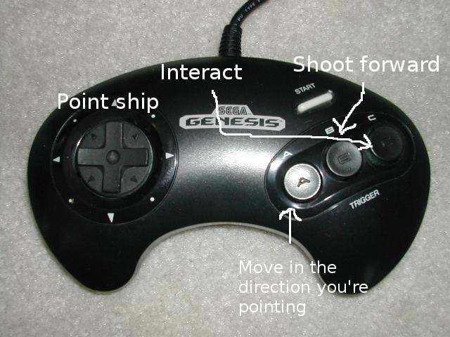

# [Main Page](index.md) \| [Blog](blog.md)

### Blog Post #11: NPCs are nearly done, and big code refactoring
I've done a good NPC handling system done, now all I have to do is add an NPC behaviour system, and NPC collision detection. I am not at all looking forward to this :/

In other words, however, I refactored my code and now it looks great! I seperated the engine from the assets and it's looking great. Super happy with that. There is no avoiding it now. I have to do NPC collision detection.

### Blog Post #10: NPCs How Do I Do Them?

Alright. NPC's What's the best way to do them? I don't know as of now. But I hope to find out! This blog post is more for me rambling n about different solutions.

What's my end goal? Well... I want a bunch of NPCs with dialogue and the ability to move. But also is able to be manipulated in cutscenes. I think I'll start out with a way of incorporating sprite placement in the level files. I'll likely need to use all of the sprites in lots of different situations. So a single sprite table is necessary. Or a level specific one *perhaps*. I'll need a drawing algorithm for the sprites and that could be hard to implement because I need a 

### Blog Post #9: Holy crapooli, I got 2 more people to work on my game.

Wow! Marcb0t offered to make the music for my game, honestly I am flattered, super super happy. *AND* not only did I get Marcb0t to do work on my game, I also got Tobikomi to do the art! Words cannot describe how happy I am (Oh wait yes they can, I'll do it now. Extremely happy, done). Not only that but they are giving me a sense of direction with my game. Super duper cool.

Alright on to a technical point. HOW THE FACK DO I DO DOORS!

Welp, that's enough for now. I'm going to do a git commit before I lose everything in a door related injury.

EDIT: I DID DOORS!

### Blog Post #8: Oh Baby! Collision Detection!

Woo! It's flawless! After hours of work I have good reliable collision detection. It only works with 8px aligned collision detection, but it is very easily expandable so I'm not complaining, if I need to add slopes, it shouldn't be *too* hard, so yay I guess. This post is more of a celebration than anything else. The player controller is epic!

Buy for now!

***

### Blog Post #7: Tiles down, Collisions to go...

So I finally finished the level data problem. I solved the problem by making a tileset and creating an array that contains glorified pointers to the tilesets spot in VRAM. Then, I do the exact same thing with the arrays and store an array of pointers pointing to the array of pointers which point to a spot in VRAM which are them selves are an array of pixels which are each 4 bit values (Which means there are only 16 colours per tile :\`(

So: pixel->8x8 tile->8x8 array of pointers to tile (patterns)->arbitrary size array of pointers pointing to the patterns. (level)

I don't know what the optimal size for a pattern is. I well could be 16x16 or even 32x32. It depends on what I'm going for. The bigger the patterns and the less I use them the less space I use. But if the patterns are big I will have to create many patterns to fill the entire level. But if I go with smaller patterns, I may have to repeat myself a lot in the level data. If I go either way too much, I lose space in my ROM.

Once I've figured out the optimum pattern size, I can start with collision detection. (Aww man!)

If you didn't know, collision detection is hard. Really hard. And the CPU speed of the 68k makes collision even harder.

There is an unavoidable bug in all discrete collision detection where if you're going fast enough and the wall is thin enough, you will go straight through a wall. I'll try to explain it with some ASCII art:

```
o = object
|| = wall
o    o    o    o    o || o    o    o    o

|    |    |    |    |    |    |    |    |
             --> frame no.
```

As you can see the object is flying really fast. Larger than the width of the wall it should have collided with. So on any given frame the object is not colliding with the wall. I'll try to fix this bug with not much CPU usage but there is no guarantee that will happen. It shouldn't matter that much, as the top speed of the player isn't that high and the smallest a tile can be is 8px. that means that to not phase through it I need to move less than 4px per frame. Which, is 4\*60=240, about 0.75 screen lengths per second. Which is, I *think* is not a problem. If it is, I can make the direction I get pushed back based on my velocity increasing this to 8px with very little extra CPU usage.

Now, there are multiple approaches to collision detection. The one I want to go for is AABB (Axis Aligned Bounding Box) collision detection. This is an efficient way to do collisions however it doesn't support slopes. But I have a solution to that. If I hit a piece of collision data with a specific value (For example a 45° slope) It will figure out how far to push me up based off a table of values that is addressed with the position relative to the tile. This seems like a novel, efficient solution. Possible cons to it include:

1. Having to store information about the tile somewhere:
2. You know what, the benefits grossly outweigh the problems. So I'm just gonna go with that.

I found a really cool collision detection system on the internet called Minkowoski Difference AABB collision detection. I can't exactly remember how to do it but it seems like a pretty good AABB solution.

I really, *really* don't want to iterate over every tile if I don't have to. Or, perhaps shoehorn my collision detection into the drawing script (Oh wait that won't work I don't iterate over everything there...)

Oh yeah, almost forgot. I changed the sound engine to the Echo sound engine because I couldn't do compression with the VGM player. I couldn't just have >40KB per song. Or I'd be hitting my 4MB limit extremely quickly.

Welp I think that's all I have to say now. Bye for now.

***

### Blog Post #6: How do draw tiles properly?

I have an interesting problem. I need a way to store level data in a way that is both efficient and low on storage. I'm not sure how sonic does it but I think I can build an efficient storage system using as few as 4 bytes. 

***

### Blog Post #5: I love Kubilus1!

I don't know where I would be without him. Just a few hours ago he updated gendev to SGDK version 1.3! That means I can commence work on my game properly now! Damn I'm exited. I couldn't figure out porting my old work over so I just said fuck it and started again. Not a problem because it was so little work. I really wanna finish this game.

Bye for now.

***

### Blog Post #4: Fuck...

I'm feeling really shit about this right now.

Tried to port the game to the latest version of SGDK but Gendev won't let me do that...

Errors errors errors.

The code just melts into a pot of pain. Extreme pain.

Maybe I should just install a copy of windows just for this. Gendev is old. It uses something like SGDK version 1.1 or some shiz. That's just unacceptable.

Even on the game side of things I really haven't made much progress.

I made the most basic movement thing and I'm not very happy with it. Firstly it's nasty spaghetti code and secondly there's this bug with that specific version of SGDK stopping a method from working properly.

You know what? I'm gonna have to get SGDK 1.3 working on Linux if I'm ever gonna let this project succeed. But I sucks so much.

Bye for now.

***

### Blog Post #3: Thoughts on PC ports for exposure

I want to make a game. That's said and done. But do I *really* want to a Genesis game? My heart is saying yes, but what if nobody finds out about it because it's a genesis game and not a PC game? I think the best answer to this is to emulate a PC. Perhaps I could fork an open source emulator and *pretend* like it's native. Sonic 2 for the phones did that!

But god that's a bit of effort. It'll be alright.

<sup><sup><sup>*I kinda wanna make money*</sup></sup></sup>

But that's for later. For now. Gotta start on the player controller.

Signing out :)

***

### Blog Post #2: I've got stuff to say now!

Just finished ideating my player controller. Looks like we'll be having a top down space shooter meets RPG type deal. I hope it works out on a genesis controller. Cause if it doesn't that'll be a lot of time down the drain.

I can already think of a few problems with the idea.

1. The game would really benefit from being a duel stick shooter, but it can't be
2. The lack of inbetweens with the genesis controller would make steering the ship and making it point at enemy's hard. However, I can imagine that not being too much of a problem. Cave story never had problems with missing, and it had no inbetweens. Heck, even Asteroids shot directly forward making aiming hard, but still doable.
3. Crap Just realised that I'm going to need an accelerator button.

So if I map out the controls there is: The directional buttons for pointing the ship. A for the accelerator, B is for the gun and C is to interact with the rest of the world. I think this controller might just work. Pretty happy with that.

 

***

### Blog Post #1: Just Starting

This blog is mostly for me to have a todo and set out goals for the coming weeks so stop reading it now pls.

OK, I'm the only one reading it now? Cool.

Alright, I actually don't know what to write. I'm organising ideas and stuff with a blog so this is the first one.

EEEH have this picture of puppy:


***